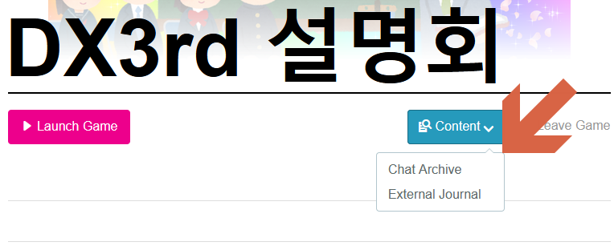
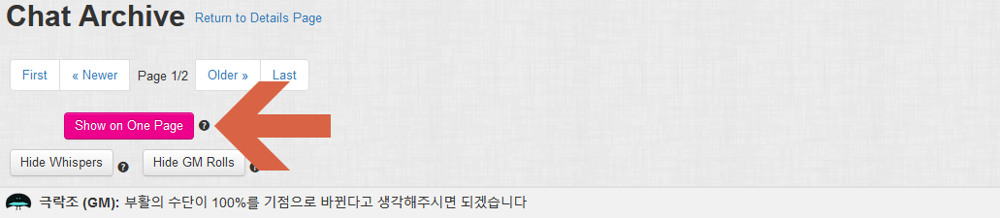
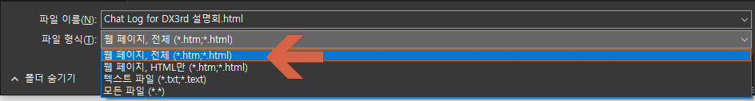
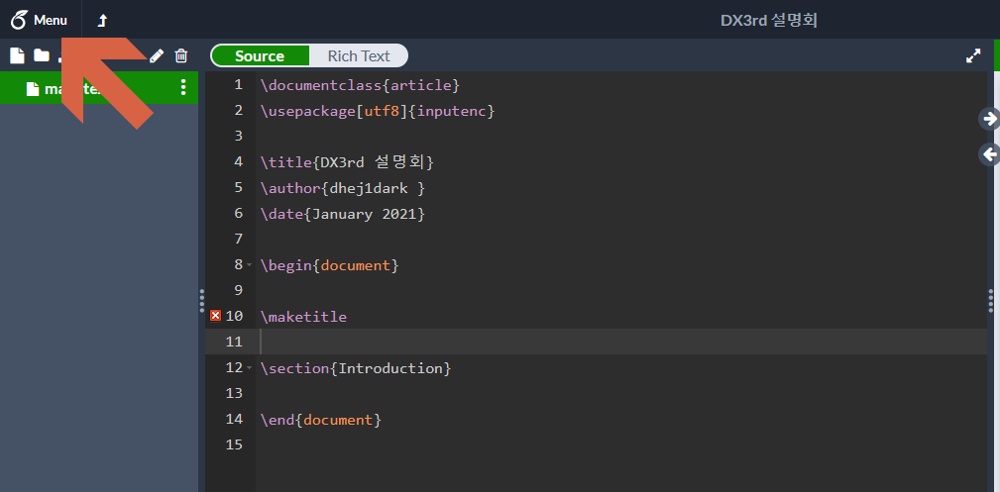
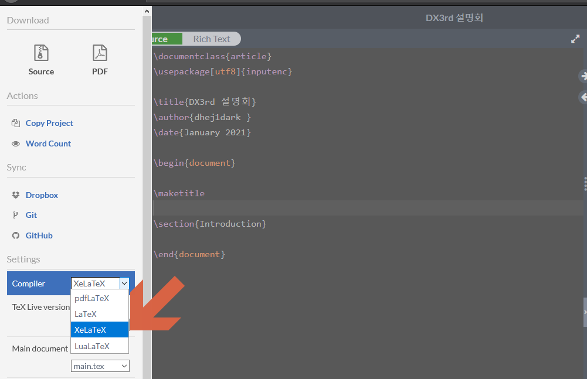
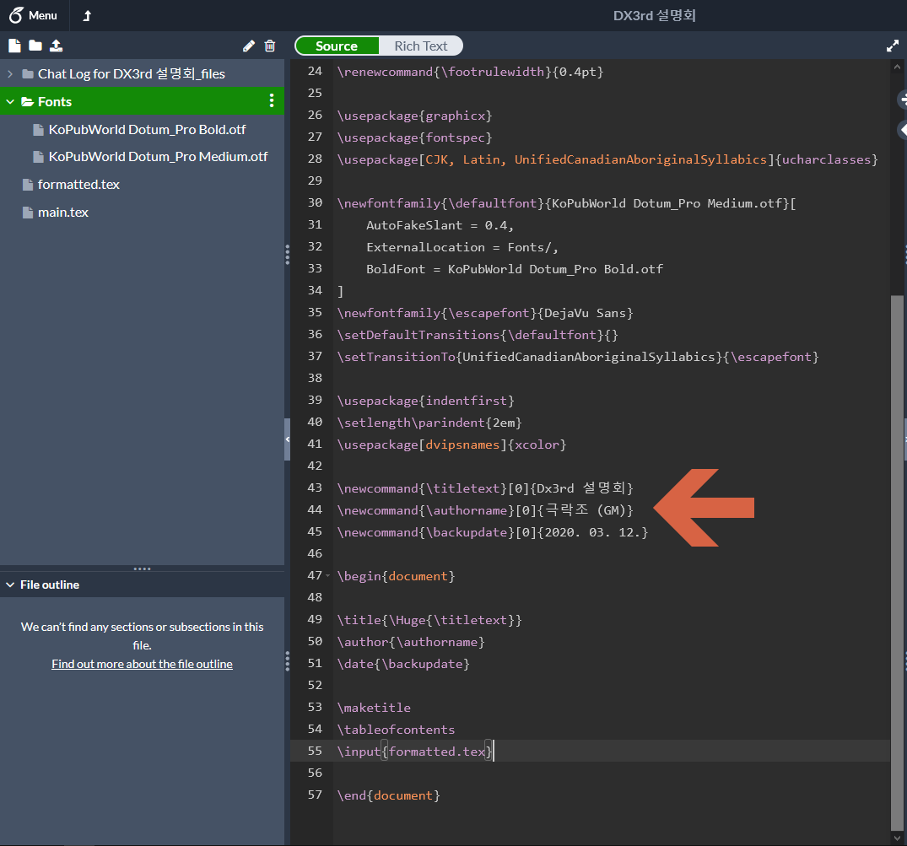

# Intro

이 repo는 roll20 채팅 기록(html)을 파싱해서 latex 파일로 변환 후 xelatex으로 컴파일하여 최종적으로 이쁜 pdf 파일을 얻어내는 방법을 적어둔 것입니다.

# 사용법

## 0. 준비물

1. [python](https://www.python.org/downloads/). 설치 파일을 받은 뒤 설치 쭉 진행해주시면 됩니다. 다른 OS/version에서도 동작하겠지만 일단 테스트는 windows/python 3.7.3 에서 진행했습니다.
2. [KoPubWorld 돋움](http://www.kopus.org/biz/electronic/font.aspx). 수동설치 파일을 받아서 압축을 풀면 됩니다.
3. [Overleaf](https://www.overleaf.com). XeLaTeX 컴파일을 위해 필요합니다. google 계정으로 회원가입을 해두면 됩니다. 딱히 유료 계정일 필요 없이 무료 계정으로 충분히 컴파일 할 수 있으니 안심하세요.
4. [Firefox](https://www.mozilla.org/ko/firefox/new/). 이게 없더라도 수동으로 html 파일과 이미지 파일을 받아도 되지만 귀찮으니 파이어폭스로 한번에 합시다. 불여우 좋아요 불여우

## 1. 필요 library 설치

html 파싱을 위한 beautifulsoup, lxml 및 생성한 데이터를 기반으로 latex 파일을 만들어내기 위한 탬플릿 엔진 jinja2를 설치해야 합니다.
윈도우의 경우 Win+x 키를 누른 뒤 Windows Powershell을 클릭해 powershell을, MacOS 혹은 리눅스의 경우 적절한 터미널을 연 뒤 아래 명령어를 통해 필요한 library를 설치합니다.

```bash
pip install --user jinja2 beautifulsoup4 lxml
```

## 2. 파일 다운로드

이 repo중 파일 변환에 필요한 roll20_extract_and_format.py와 jinja-latex.tex을 임의의 폴더에 저장해둡니다. 되도록 모든 폴더명이 영문으로 된 경로면 좋습니다. 이 폴더를 아래부터 Roll20Chat이라고 하겠습니다.

이 과정이 끝난 뒤 Roll20Chat 폴더는 아래와 같습니다.

```
Roll20Chat
    jinja-latex.tex
    roll20_extract_and_format.py
```

다시 변환을 하고자 할 때는 아래 과정부터 진행하시면 됩니다.

## 3. roll20 채팅 다운로드

roll20 채팅 기록은 (확인해본 한도 내에서는) 따로 backup용 메타데이터를 생성해주지는 않습니다. 따라서 chat archive의 html과 사진을 따로 저장해서 이를 변환에 사용합니다.

먼저 roll20의 백업하고자 하는 Game의 Chat Archive를 파이어폭스를 통해 엽니다. Chat Archive의 위치는 아래와 같습니다.



Chat Archive 페이지를 띄웠으면 이를 한 페이지에 보여주게 해줘야 합니다. 아래 표시된 버튼을 눌러 한 페이지에 담기도록 바꿔주세요



이 다음 Ctrl+s 단축키 혹은 메뉴의 다른 이름으로 저장을 통해 해당 페이지를 저장해야 합니다. 이때, 꼭 아래 파일 형식이 웹 페이지, 전체로 되어있는지 확인해주세요



저장할 경로는 Roll20Chat로 해둡니다. 이 과정이 끝난 뒤 Roll20Chat 폴더는 아래와 같습니다.

```
Roll20Chat
│   jinja-latex.tex
│   roll20_extract_and_format.py
│   Chat Log for DX3rd 설명회.html
└─  Chat Log for DX3rd 설명회_files
        (여러 이미지 파일)
```

## 4. 변환 실행

실제 변환은 아래 명령어 한번으로 모두 수행됩니다. 중괄호{} 안은 추출한 html 파일명으로 바꿔주세요
```bash
python roll20_extract_and_format.py '{target.html}'
```
예를 들어 위 Roll20Chat 폴더 내부 상황에선 아래와 같이 실행시키면 됩니다.
```bash
python roll20_extract_and_format.py 'Chat Log for DX3rd 설명회.html'
```

실행이 정상적으로 끝나면 `done!`이 출력 된 뒤 `formatted.tex` 파일이 생성됩니다.

## 5. Overleaf 프로젝트 생성 & 설정

아까 회원가입 해둔 [Overleaf](https://www.overleaf.com)에 로그인해 New Project -> Blank Project를 통해 비어있는 프로젝트를 만듭니다.

그 후 해당 프로젝트의 LaTeX 컴파일러를 XeLaTeX으로 바꿔줘야 합니다. 메뉴에서 compiler를 xelatex으로 변경해줍니다.





## 6. 파일 업로드

이제 필요한 파일을 모두 업로드 합니다. 이미지 파일이 들어있는 `..._file` 폴더는 폴더명 그대로 업로드, 이전에 받아뒀던 KoPubWorld 돋움은 `Fonts` 폴더를 만들어 그 안에 `KoPubWorld Dotum_Pro Medium.otf`와  `KoPubWorld Dotum_Pro Bold.otf`를 업로드하고 최상위에 생성된 `formatted.tex`을 업로드 한 뒤 `main.tex`의 내용물을 이 repo의 `main.tex`으로 바꿔주면 됩니다.

이 과정이 끝난 뒤 Overleaf 프로젝트의 상태는 아래와 같습니다. `main.tex`의 43~45번째 줄을 표시와 같이 바꿔주면 제목과 저자 등이 이쁘게 나옵니다.



이제 Recompile 버튼을 누르고 잠시 기다리면 이쁜 pdf가 나옵니다. 다운로드 해서 마음껏 사용하시면 됩니다.
